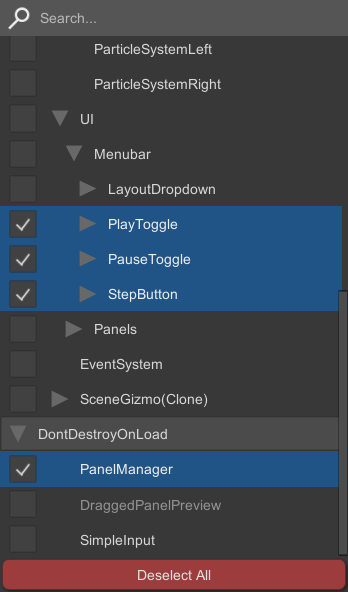
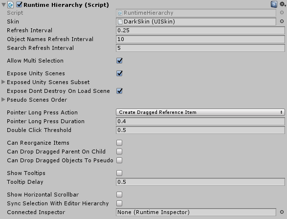
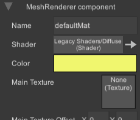
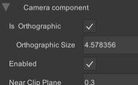

# Runtime Inspector & Hierarchy for Unity 3D

 

**Available on Asset Store:** https://assetstore.unity.com/packages/tools/gui/runtime-inspector-hierarchy-111349

**Forum Thread:** https://forum.unity.com/threads/runtime-inspector-and-hierarchy-open-source.501220/

**Discord:** https://discord.gg/UJJt549AaV

**[Support the Developer ☕](https://yasirkula.itch.io/unity3d)**

## A. ABOUT

This is a simple yet powerful runtime **Inspector** and **Hierarchy** solution for Unity 3D that should work on pretty much any platform that Unity supports, including mobile platforms.

## B. LICENSE

Runtime Inspector & Hierarchy is licensed under the [MIT License](LICENSE) ([Asset Store version](https://www.assetstore.unity3d.com/en/#!/content/111349) is governed by the [Asset Store EULA](https://unity3d.com/legal/as_terms)). Please note that this asset uses an external asset which is licensed under the [BSD 3-Clause License](https://github.com/fkate/Unity_ColorWheel/blob/master/LICENSE).

## C. INSTALLATION

There are 5 ways to install this plugin:

- import [RuntimeInspector.unitypackage](https://github.com/yasirkula/UnityRuntimeInspector/releases) via *Assets-Import Package*
- clone/[download](https://github.com/yasirkula/UnityRuntimeInspector/archive/master.zip) this repository and move the *Plugins* folder to your Unity project's *Assets* folder
- import it from [Asset Store](https://assetstore.unity.com/packages/tools/gui/runtime-inspector-hierarchy-111349)
- *(via Package Manager)* add the following line to *Packages/manifest.json*:
  - `"com.yasirkula.runtimeinspector": "https://github.com/yasirkula/UnityRuntimeInspector.git",`
- *(via [OpenUPM](https://openupm.com))* after installing [openupm-cli](https://github.com/openupm/openupm-cli), run the following command:
  - `openupm add com.yasirkula.runtimeinspector`

## D. HOW TO

- To use the hierarchy in your scene, drag&drop the **RuntimeHierarchy** prefab to your canvas
- To use the inspector in your scene, drag&drop the **RuntimeInspector** prefab to your canvas

You can connect the inspector to the hierarchy so that whenever the selection in the hierarchy changes, inspector inspects the newly selected object. To do this, assign the inspector to the **Connected Inspector** property of the hierarchy.

You can also connect the hierarchy to the inspector so that whenever an object reference in the inspector is highlighted, the selection in hierarchy is updated. To do this, assign the hierarchy to the **Connected Hierarchy** property of the inspector.

Note that these connections are *one-directional*, meaning that assigning the inspector to the hierarchy will not automatically assign the hierarchy to the inspector or vice versa. Also note that the inspector and the hierarchy are **not** singletons and therefore, you can have several instances of them in your scene at a time with different configurations.

### NEW INPUT SYSTEM SUPPORT

This plugin supports Unity's new Input System but it requires some manual modifications (if both the legacy and the new input systems are active at the same time, no changes are needed):

- the plugin mustn't be installed as a package, i.e. it must reside inside the *Assets* folder and not the *Packages* folder (it can reside inside a subfolder of Assets like *Assets/Plugins*)
- if Unity 2019.2.5 or earlier is used, add `ENABLE_INPUT_SYSTEM` compiler directive to **Player Settings/Scripting Define Symbols** (these symbols are platform specific, so if you change the active platform later, you'll have to add the compiler directive again)
- add `Unity.InputSystem` assembly to **RuntimeInspector.Runtime** Assembly Definition File's *Assembly Definition References* list

## E. FEATURES

- Both panels are heavily optimized in terms of GC in order not to cause any unnecessary allocations. By default, both the inspector and the hierarchy are refreshed 4 times a second to reflect any changes to their user interface almost immediately. Each refresh of the inspector generates some garbage for GC since most of the time, the inspected object has variables of value types. These variables are *boxed* when accessed via reflection and this boxing creates some unavoidable garbage. However, this process can be greatly optimized by increasing the **Refresh Interval** of the inspector and/or the hierarchy
- Includes a built-in color picker and a reference picker:


- Visual appearance of the inspector and the hierarchy can be tweaked by changing their **Skin**. There are two premade skins included in the **Skins** directory: *LightSkin* and *DarkSkin*. You can create your own skins using the **Assets-Create-yasirkula-RuntimeInspector-UI Skin** context menu


- The hierarchy supports multi-selection:



### E.1. INSPECTOR


RuntimeInspector works similar to the editor Inspector. It can expose commonly used Unity types out-of-the-box, as well as custom classes and structs that are marked with **System.Serializable** attribute. 1-dimensional arrays and generic Lists are also supported. 

- **Refresh Interval**: as the name suggests, this is the refresh interval of the inspector. At each refresh, values of all the exposed fields and properties are refreshed. This generates some garbage for boxed value types (unavoidable) and thus, increasing this value even slightly should help with GC a lot
- **Expose Fields**: determines which fields of the inspected object should be exposed: *None*, *Serializable Only* or *All*
- **Expose Properties**: determines which properties of the inspected object should be exposed
- **Array Indices Start At One**: when enabled, exposed arrays and lists start their indices at 1 instead of 0 (just a visual change)
- **Use Title Case Naming**: when enabled, variable names are displayed in title case format (e.g. *m_myVariable* becomes *My Variable*)
- **Show Add Component Button**: when enabled, *Add Component* button will appear while inspecting a GameObject
- **Show Remove Component Button**: when enabled, *Remove Component* button will appear under inspected components
- **Show Tooltips**: when enabled, hovering over a variable's name for a while will show a tooltip displaying the variable's name. Can be useful for variables whose names are partially obscured
- **Tooltip Delay**: determines how long the cursor should remain static over a variable's name before the tooltip appears. Has no effect if *Show Tooltips* is disabled
- **Nest Limit**: imagine exposing a linked list. This variable defines how many nodes you can expose in the inspector starting from the initial node until the inspector stops exposing any further nodes
- **Inspected Object Header Visibility**: if the inspected object has a collapsible header, determines that header's visibility
- **Pool Capacity**: the UI elements are pooled to avoid unnecessary *Instantiate* and *Destroy* calls. This value defines the pool capacity for each of the UI elements individually. On standalone platforms, you can increase this value for better performance
- **Settings**: an array of settings for the inspector. A new settings asset can be created using the **Assets-Create-yasirkula-RuntimeInspector-Settings** context menu. A setting asset stores 4 different things:
  - **Standard Drawers** and **Reference Drawers**: a drawer is a prefab used to expose a single variable in the inspector. For variables that extend **UnityEngine.Object**, a reference drawer is created and for other variables, a standard drawer is created
    - While searching for a suitable drawer for a variable, the corresponding drawers list is traversed from bottom to top until a drawer that supports that variable type is found. If such a drawer is not found, that variable is not exposed
  - **Hidden Variables**: allows you to hide some variables from the inspector for a given type and all the types that extend/implement it. You can enter asterisk character (\*) to hide all the variables for that type
  - **Exposed Variables**: allows you to expose (counter) some hidden variables. A variable goes through a number of filters before it is exposed:
  1. Its Type must be serializable
  2. It must not have a *System.Obsolete*, *System.NonSerialized* or *HideInInspector* attribute
  3. If it is in *Exposed Variables*, it is exposed
  4. It must not be in *Hidden Variables*
  5. it must pass the *Expose Fields* and *Expose Properties* filters
  - So, to expose only a specific set of variables for a given type, you can hide all of its variables by entering an asterisk to its *Hidden Variables* and then entering the set of exposed variables to its *Exposed Variables*

While changing the inspector's settings, you are advised not to touch **InternalSettings**; instead create a separate Settings asset and add it to the **Settings** array of the inspector. Otherwise, when *InternalSettings* is changed in an update, your settings might get overridden.

### E.2. HIERARCHY



RuntimeHierarchy simply exposes the objects in your scenes to the user interface. In addition to exposing the currently active Unity scenes in the hierarchy, you can also expose a specific set of objects under what is called a **pseudo-scene** in the hierarchy. Pseudo-scenes can help you categorize the objects in your scene. Adding/removing objects to/from pseudo-scenes is only possible via the scripting API and helper components.

- **Refresh Interval**: the refresh interval of the hierarchy. At each refresh, the destroyed objects are removed from the hierarchy while newly created objects are added to the hierarchy. Sibling indices of the objects are also synced with the Unity Hierarchy at each refresh
- **Object Names Refresh Interval**: accessing **GameObject.name** property generates garbage. Therefore, names of objects in the hierarchy are not synced at each *Refresh Interval* but rather at each *Object Names Refresh Interval* to help avoid excessive garbage
- **Search Refresh Interval**: the refresh interval for the search results. At each refresh, each GameObject's name is checked to see if it matches the searched term, so this process will generate some garbage
- **Allow Multi Selection**: when disabled, only a single Transform can be selected in the hierarchy
- **Expose Unity Scenes**: when disabled, Unity scenes are not exposed in the hierarchy. This is useful when you want to use the hierarchy solely for pseudo-scenes
- **Exposed Unity Scenes Subset**: specifies the scenes that are exposed in the hierarchy by their name. When empty, all scenes are exposed
- **Expose Dont Destroy On Load Scene**: when enabled, *DontDesroyOnLoad* objects will be exposed in the hierarchy
- **Pseudo Scenes Order**: the order of the pseudo-scenes from top to bottom in the hierarchy. Note that entering a pseudo-scene here does not automatically create it when the application starts. Pseudo-scenes can be created via the scripting API only
- **Pointer Long Press Action**: determines what will happen when an object is clicked and then held for a while:
  - **None**: nothing ¯\\\_(ツ)\_/¯
  - **Create Dragged Reference Item**: creates a **dragged reference item** that can be dropped onto a *reference drawer* in the inspector to assign the held object(s) to that variable (similar to Unity's drag&drop reference assignment)
  - **Show Multi Selection Toggles**: displays multi-selection toggles in front of each object. This is mostly useful on mobile devices where CTRL and Shift keys aren't present. Has no effect if *Allow Multi Selection* is disabled
  - **Show Multi Selection Toggles Then Create Dragged Reference Item**: if multi-selection toggles aren't visible, displays them. Otherwise, creates a dragged reference item
- **Pointer Long Press Duration**: determines how long an object should be held until the *Pointer Long Press Action* is executed
- **Double Click Threshold**: when an object in the hierarchy is double clicked, **OnItemDoubleClicked** event is raised (see *SCRIPTING API*). This value determines the maximum allowed delay between two clicks to register a double click
- **Can Reorganize Items**: when enabled, dropping a dragged reference item that holds Transform(s) onto an object in the hierarchy will change the dragged Transform(s)' parents (similar to parenting in Unity's Hierarchy)
- **Can Drop Dragged Parent On Child**: when enabled, a dragged reference item can be dropped onto one of its child objects. In this case, the child object will be unparented and then the dragged reference item will become a child of it. Has no effect if *Can Reorganize Items* is disabled
- **Can Drop Dragged Objects To Pseudo Scenes**: when enabled, dropping a dragged reference item onto a pseudo-scene or above/below a root object in the pseudo-scene will automatically add it to that pseudo-scene. Has no effect if *Can Reorganize Items* is disabled
- **Show Tooltips**: when enabled, hovering over an object for a while will show a tooltip displaying the object's name. Can be useful for objects with very long names
- **Tooltip Delay**: determines how long the cursor should remain static over an object before the tooltip appears. Has no effect if *Show Tooltips* is disabled
- **Show Horizontal Scrollbar**: when enabled, a horizontal scrollbar will be displayed if the names displayed in the hierarchy don't fit the available space. Note that only the visible items' width values are used to determine the size of the scrollable area
- **Sync Selection With Editor Hierarchy**: simply synchronizes the selected object between the Unity Hierarchy and this RuntimeHierarchy

Additional settings for *Can Reorganize Items* can be found at the *RuntimeHierarchy/ScrollView/Viewport* object:


- **Sibling Index Modification Area**: when a dragged reference item is dropped near the top or bottom edges of a Transform in hierarchy, it will be inserted above or belove the target Transform. This value determines the size of the area near the top and bottom edges
- **Scrollable Area**: while hovering the cursor near the top or bottom edges of the scroll view with a dragged reference item, scroll view will automatically be scrolled to show contents in that direction. This value determines the size of the area near the top and bottom edges of the scroll view
- **Scroll Speed**: determines how fast the scroll view will be scrolled while hovering the cursor over *Scrollable Area*

## F. SCRIPTING API

Values of the variables that are mentioned in **E.1** and **E.2** sections can be tweaked at runtime via their corresponding properties. Any changes to these properties will be reflected to UI immediately. Here, you will find some interesting things that you can do with the inspector and the hierarchy via scripting:

- You can change the inspected object in the inspector using the following functions:

```csharp
public void Inspect( object obj );
public void StopInspect();
```

- You can access the currently inspected object via the `InspectedObject` property of the inspector
- You can change the selected object in the hierarchy using the following functions:

```csharp
// SelectOptions is an enum flag meaning that it can take multiple values with | (OR) operator. These values are:
// - Additive: new selection will be appended to the current selection instead of replacing it
// - FocusOnSelection: scroll view will be snapped to the selected object(s)
// - ForceRevealSelection: normally, when selection changes, the new selection will be fully explored in the hierarchy (i.e. all of the parents of the selection will be
//   expanded to reveal the selection). This doesn't automatically happen if selection doesn't change. When this flag is set, however, the selected objects will be fully
//   revealed/explored even if the selection doesn't change
public bool Select( Transform selection, SelectOptions selectOptions = SelectOptions.None ); // Selects the specified Transform. Returns true when the selection is changed successfully
public bool Select( IList<Transform> selection, SelectOptions selectOptions = SelectOptions.None ); // Selects the specified Transform(s)

public void Deselect(); // Deselects all Transforms
public void Deselect( Transform deselection ); // Deselects only the specified Transform
public void Deselect( IList<Transform> deselection ); // Deselects only the specified Transform(s)

public bool IsSelected( Transform transform ); // Returns true if the selection includes the Transform
```

- You can access the currently selected object(s) in the hierarchy via the `CurrentSelection` property
- Hierarchy's multi-selection toggles can be enabled manually via the `MultiSelectionToggleSelectionMode` property
- You can call the `Refresh()` function on the inspector and/or the hierarchy to refresh them manually
- You can lock the inspector and/or the hierarchy via the `IsLocked` property
- You can register to the `OnSelectionChanged` event of the hierarchy to get notified when the selection has changed
- You can register to the `OnInspectedObjectChanging` delegate of the inspector to get notified when the inspected object is about to change and, if you prefer, change the inspected object altogether. For example, if you want to inspect only objects that have a *Renderer* component attached, you can use the following function:

```csharp
private object OnlyInspectObjectsWithRenderer( object previousInspectedObject, object newInspectedObject )
{
	GameObject go = newInspectedObject as GameObject;
	if( go != null && go.GetComponent<Renderer>() != null )
		return newInspectedObject;

	// Don't inspect objects without a Renderer component
	return null;
}
```

- You can register to the `ComponentFilter` delegate of the inspector to filter the list of visible components of a GameObject in the inspector (e.g. hide some components)

```csharp
runtimeInspector.ComponentFilter = ( GameObject gameObject, List<Component> components ) =>
{
    // Simply remove the undesired Components from the 'components' list
};
```

- You can register to the `GameObjectFilter` delegate of the hierarchy to hide some objects from the hierarchy (or, you can add those objects to `RuntimeInspectorUtils.IgnoredTransformsInHierarchy` and they will be hidden from all hierarchies; just make sure to remove them from this *HashSet* before they are destroyed)

```csharp
runtimeHierarchy.GameObjectFilter = ( Transform obj ) =>
{
    if( obj.CompareTag( "Main Camera" ) )
        return false; // Hide Main Camera from hierarchy
 
    return true;
};
```

- You can register to the `OnItemDoubleClicked` event of the hierarchy to get notified when an object in the hierarchy is double clicked
- You can add **RuntimeInspectorButton** attribute to your functions to expose them as buttons in the inspector. These buttons appear when an object of that type is inspected. This attribute takes 3 parameters:
  - **string label**: the text that will appear on the button
  - **bool isInitializer**: if set to true and the function returns an object that is assignable to the type that the function was defined in, the resulting value of the function will be assigned back to the inspected object. In other words, this function can be used to initialize null objects or change the variables of structs
  - **ButtonVisibility visibility**: determines when the button can be visible. Buttons with `ButtonVisibility.InitializedObjects` can appear only when the inspected object is not null whereas buttons with `ButtonVisibility.UninitializedObjects` can appear only when the inspected object is null. You can use `ButtonVisibility.InitializedObjects | ButtonVisibility.UninitializedObjects` to always show the button in the inspector
- Although you can't add *RuntimeInspectorButton* attribute to Unity's built-in functions, you can show buttons under built-in Unity types via **extension methods**. You must write all such extension methods in a single static class, mark the methods with *RuntimeInspectorButton* attribute and then introduce these functions to the RuntimeInspector as follows: `RuntimeInspectorUtils.ExposedExtensionMethodsHolder = typeof( TheScriptThatContainsTheExtensionsMethods );`

### F.1. PSEUDO-SCENES

You can use the following functions to add object(s) to pseudo-scenes in the hierarchy:

```csharp
public void AddToPseudoScene( string scene, Transform transform );
public void AddToPseudoScene( string scene, IEnumerable<Transform> transforms );
```

These functions will create the relevant pseudo-scenes automatically if they do not exist.

You can use the following functions to remove object(s) from pseudo-scenes in the hierarchy:

```csharp
public void RemoveFromPseudoScene( string scene, Transform transform, bool deleteSceneIfEmpty );
public void RemoveFromPseudoScene( string scene, IEnumerable<Transform> transforms, bool deleteSceneIfEmpty );
```

You can use the following functions to create or delete a pseudo-scene manually:

```csharp
public void CreatePseudoScene( string scene );
public void DeletePseudoScene( string scene );
public void DeleteAllPseudoScenes();
```

#### F.1.1. PseudoSceneSourceTransform

This helper component allows you to add an object's children to a pseudo-scene in the hierarchy. When a child is added to or removed from the object, this component refreshes the pseudo-scene automatically. If **HideOnDisable** is enabled, the object's children are removed from the pseudo-scene when the object is disabled.

### F.2. COLOR PICKER

You can access the built-in color picker via **ColorPicker.Instance** and then present it with the following function:

```csharp
public void Show( ColorWheelControl.OnColorChangedDelegate onColorChanged, ColorWheelControl.OnColorChangedDelegate onColorConfirmed, Color initialColor, Canvas referenceCanvas );
```

- **onColorChanged**: invoked regularly as the user changes the color. `ColorWheelControl.OnColorChangedDelegate` takes a *Color32* parameter
- **onColorConfirmed**: invoked when user submits the color via *OK* button
- **initialColor**: the initial value of the color picker
- **referenceCanvas**: if assigned, the reference canvas' properties will be copied to the color picker canvas

You can change the color picker's visual appearance by assigning a *UISkin* to its **Skin** property.

### F.3. OBJECT REFERENCE PICKER

You can access the built-in object reference picker via **ObjectReferencePicker.Instance** and then present it with the following function:

```csharp
public void Show( ReferenceCallback onReferenceChanged, ReferenceCallback onSelectionConfirmed, NameGetter referenceNameGetter, NameGetter referenceDisplayNameGetter, object[] references, object initialReference, bool includeNullReference, string title, Canvas referenceCanvas );
```

- **onReferenceChanged**: invoked when the user selects a reference from the list. `ReferenceCallback` takes an *object* parameter
- **onSelectionConfirmed**: invoked when user submits the selected reference via *OK* button
- **referenceNameGetter**: `NameGetter` takes an *object* parameter and returns that object's name as string. The passed function will be used to sort the references list and compare the references' names with the search string
- **referenceDisplayNameGetter**: the passed function will be used to get display names for the references. Usually, the same function is passed to this parameter and the *referenceNameGetter* parameter
- **references**: array of references to pick from
- **initialReference**: initially selected reference
- **includeNullReference**: is set to *true*, a null reference option will be added to the top of the references list
- **title**: title of the object reference picker
- **referenceCanvas**: if assigned, the reference canvas' properties will be copied to the object reference picker canvas

You can change the object reference picker's visual appearance by assigning a *UISkin* to its **Skin** property.

### F.4. DRAGGED REFERENCE ITEMS

In section **E.2**, it is mentioned that you can drag&drop objects from the hierarchy to the variables in the inspector to assign these objects to those variables. However, you are not limited with just hierarchy. There are two helper components that you can use to create dragged reference items for other objects:

- **DraggedReferenceSourceCamera**: when attached to a camera, casts a ray to your scene at each mouse click and creates a dragged reference item if you hold on an object for a while. You can register to the **ProcessRaycastHit** delegate of this component to filter the objects than can create a dragged reference item. For example, if you want only objects with tag *NPC* to be able to create a dragged reference item, you can use the following function:

```csharp
private Object CreateDraggedReferenceItemForNPCsOnly( RaycastHit hit )
{
	if( hit.collider.gameObject.CompareTag( "NPC" ) )
		return hit.collider.gameObject;

	// Non-NPC objects can't create dragged reference items
	return null;
}
```

- **DraggedReferenceSourceUI**: when assigned to a UI element, that element can create a dragged reference item for its **References** object(s) after it is clicked and held for a while

You can also use your own scripts to create dragged reference items by calling the following functions in the **RuntimeInspectorUtils** class:

```csharp
public static DraggedReferenceItem CreateDraggedReferenceItem( Object reference, PointerEventData draggingPointer, UISkin skin = null );
public static DraggedReferenceItem CreateDraggedReferenceItem( Object[] references, PointerEventData draggingPointer, UISkin skin = null, Canvas referenceCanvas = null );
```

## G. CUSTOM DRAWERS (EDITORS)

**NOTE:** if you just want to hide some fields/properties from the RuntimeInspector, simply use **Settings** asset's **Hidden Variables** list (mentioned in section **E.1**).

You can introduce your own custom drawers to RuntimeInspector. These drawers will then be used to draw inspected objects' properties in RuntimeInspector. If no custom drawer is specified for a type, built-in *ObjectField* will be used to draw all properties of that type. There are 2 ways to create custom drawers:

- Creating a drawer prefab and adding it to the **Settings** asset mentioned in section **E.1**. Each drawer extends from **InspectorField** base class. There is also an **ExpandableInspectorField** abstract class that allows you to create an expandable/collapsable drawer like arrays. Lastly, extending **ObjectReferenceField** class allows you to create drawers that can be assigned values via the reference picker or via drag&drop
  - This option provides the most flexibility because you'll be able to customize the drawer prefab as you wish. The downside is, you'll have to create a prefab asset and manually add it to RuntimeInspector's **Settings** asset. All built-in drawers use this method; they can be as simple as **BoolField** and **TransformField**, or as complex as **BoundsField**, **GameObjectField** and **ArrayField**
- Extending **IRuntimeInspectorCustomEditor** interface and decorating the class/struct with **RuntimeInspectorCustomEditor** attribute
  - This option is simpler because you won't have to create a prefab asset for the drawer. Created custom drawer will internally be used by *ObjectField* to populate its sub-drawers. This option should be sufficient for most use-cases. But imagine that you want to create a custom drawer for Matrix4x4 where the cells are displayed in a 4x4 grid. In this case, you must use the first option because you'll need a custom prefab with 16 InputFields organized in a 4x4 grid for it. But if you can represent the custom drawer you have in mind by using a combination of built-in drawers, then this second option should suffice

### G.1. InspectorField

To have a standardized visual appearance across all the drawers, there are some common variables for each drawer:

- **Layout Element**: is used to set the height of the drawer. A standard height is set by the currently active Inspector skin's **Line Height** property. This value is multiplied by the virtual **HeightMultiplier** property of the drawer. For ExpandableInspectorField's of unknown height, this variable should be left unassigned
- **Variable Name Text**: the **Text** object that displays the name of the exposed variable
- **Variable Name Mask**: to understand this one, you may have to examine a simple drawer like BoolField. An **Image** is drawn on top of the *Variable Name Text* in order to mask its visible area in an efficient way. And this mask is assigned to this variable

Each drawer has access to the following properties:

- **object Value**: the most recent value of the variable that this drawer is bound to. It is refreshed at each refresh interval of the inspector. Changing this property will also change the bound object
- **RuntimeInspector Inspector**: the RuntimeInspector that currently uses this drawer
- **UISkin Skin**: the skin that is assigned to this drawer
- **Type BoundVariableType**: the type of the bound object
- **int Depth**: the depth that this drawer is drawn at. As Depth increases, a padding should be applied to the contents of this drawer from left (in OnDepthChanged function)
- **string Name**: the name of the bound variable. When set, the variable name is converted to title case format if *Use Title Case Naming* is enabled in the inspector
- **string NameRaw**: When set, the variable name is used as is without being converted to title case format
- **float HeightMultiplier**: affects the height of the drawer

There are some special functions on drawers that are invoked on certain circumstances:

- **void Initialize()**: should be used instead of *Awake*/*Start* to initialize the drawer
- **bool SupportsType( Type type )**: returns whether or not this drawer can expose (supports) a certain type in the inspector
- **bool CanBindTo( Type type, MemberInfo variable )**: returns whether or not this drawer can expose the provided *variable*. This function is called only if *SupportsType* returns *true*. This function is useful for drawers that can expose only variables with specific attribute(s) (e.g. *NumberRangeField* queries RangeAttribute). Please note that the *variable* parameter **can be** *null*. By default, this function returns true
- **void OnBound( MemberInfo variable )**: called when the drawer is bound to a variable via reflection. Please note that the *variable* parameter **can be** *null*
- **void OnUnbound()**: called when the drawer is unbound from the variable that it was bound to
- **void OnInspectorChanged()**: called when the *Inspector* property of the drawer is changed
- **void OnSkinChanged()**: called when the *Skin* property of the drawer is changed. Your custom drawers must adjust their UI elements' visual appearance here to comply with the assigned skin's standards
- **void OnDepthChanged()**: called when the *Depth* property of the drawer is changed. Here, your custom drawers must add a padding to their content from left to comply with the nesting standard. This function is also called when the *Skin* changes
- **void Refresh()**: called when the value of the bound object is refreshed. Drawers must refresh the values of their UI elements here. Invoked by RuntimeInspector at every **Refresh Interval** seconds

### G.2. ExpandableInspectorField

Custom drawers that extend **ExpandableInspectorField** have access to the following properties:

- **bool IsExpanded**: returns whether the drawer is expanded or collapsed. When set to *true*, the drawer is expanded and its contents are drawn under it
- **HeaderVisibility HeaderVisibility**: sets the visibility of this drawer's header: **Collapsible**, **AlwaysVisible** or **Hidden**. By default, this value is set to *Collapsible*
- **int Length**: the number of elements that this drawer aims to draw. If its value does not match the number of child drawers that this drawer has, the contents of the drawer are regenerated

*ExpandableInspectorField* has the following special functions:

- **void GenerateElements()**: the sub-drawers of this drawer must be generated here 
- **void ClearElements()**: the sub-drawers of this drawer must be cleared here

Sub-drawers of an ExpandableInspectorField should be stored in the `protected List<InspectorField> elements` variable as ExpandableInspectorField uses this list to compare the number of sub-drawers with the *Length* property. When *Refresh()* is called, sub-drawers in this list are refreshed automatically and when *ClearElements()* is called, sub-drawers in this list are cleared automatically.

You can create sub-drawers using the `RuntimeInspector.CreateDrawerForType( Type type, Transform drawerParent, int depth, bool drawObjectsAsFields = true )` function. If no drawer is found that can expose this type, the function returns *null*. Here, for ExpandableInspectorFields, the **drawerParent** parameter should be set as the **drawArea** variable of the ExpandableInspectorField. If the **drawObjectsAsFields** parameter is set to true and if the type extends **UnityEngine.Object**, *Reference Drawers* are searched for a drawer that supports this type. Otherwise *Standard Drawers* are searched.

After creating sub-drawers, *ExpandableInspectorField*s must bind their sub-drawers to their corresponding variables manually. This is done via the following **BindTo** functions of the *InspectorField* class:

- `BindTo( InspectorField parent, MemberInfo variable, string variableName = null )`: binds the object to a **MemberInfo** (it can be received via reflection). Here, **parent** parameter should be set to this *ExpandableInspectorField*. If **variableName** is set to null, its value is fetched directly from the MemberInfo parameter
- `BindTo( Type variableType, string variableName, Getter getter, Setter setter, MemberInfo variable = null )`: this one allows you to define your own getter and setter functions for this sub-drawer. For example, *ArrayField* uses this function because there is no direct MemberInfo to access an element of an array. With this method, you can use custom functions instead of MemberInfos to get/set the values of the bound objects (ArrayField uses *Array.GetValue* for its elements' getter function and *Array.SetValue* for its elements' setter function)

There are also some helper functions in ExpandableInspectorField to easily create sub-drawers without having to call *CreateDrawerForType* or *BindTo* manually:

- `InspectorField CreateDrawerForComponent( Component component, string variableName = null )`: creates a *Standard Drawer* for a component
- `InspectorField CreateDrawerForVariable( MemberInfo variable, string variableName = null )`: creates a drawer for the variable that the *MemberInfo* stores. This variable must be declared inside inspected object's class/struct or one of its base classes
- `InspectorField CreateDrawer( Type variableType, string variableName, Getter getter, Setter setter, bool drawObjectsAsFields = true )`: similar to the *BindTo* function with the *Getter* and *Setter* parameters, allows you to use custom functions to get and set the value of the object that the sub-drawer is bound to

### G.3. ObjectReferenceField

Drawers that extend **ObjectReferenceField** class have access to the `void OnReferenceChanged( Object reference )` function that is called when the reference assigned to that drawer is changed.

### G.4. Helper Classes

**PointerEventListener**: this is a simple helper component that invokes **PointerDown** event when its UI GameObject is pressed, **PointerUp** event when it is released and **PointerClick** event when it is clicked

**BoundInputField**: most of the built-in drawers use this component for their input fields. This helper component allows you to validate the input as it is entered and also get notified when the input is submitted. It has the following properties and functions:

- **string DefaultEmptyValue**: the default value that the input field will have when its input is empty. For example, NumberField sets this value to "0"
- **string Text**: a property to refresh the current value of the input field. If the input field is currently focused and being edited, then this property will not change its text immediately but store the value in a variable so that it can be used when the input field is no longer focused. Also, setting this property will not invoke the *OnValueChanged* event
- **UISkin Skin**: the skin that this input field uses. When set, input field will adjust its UI accordingly
- **OnValueChangedDelegate OnValueChanged**: called while the value of input field is being edited (called at each change to the input). The **OnValueChangedDelegate** has the following signature: `bool OnValueChangedDelegate( BoundInputField source, string input )`. A function that is registered to this event should parse the **input** and return *true* if the input is valid, *false* otherwise
- **OnValueChangedDelegate OnValueSubmitted**: called when user finishes editing the value of input field. Similar to *OnValueChanged*, a function that is registered to this event should parse the **input** and return *true* only if the input is valid
- **bool CacheTextOnValueChange**: determines what will happen when user stops editing the input field while its contents are invalid (i.e. its background has turned red). If this variable is set to *true*, input field's text will revert to the latest value that returned *true* for OnValueChanged. Otherwise, the text will revert to the value input field had when it was focused

### G.5. RuntimeInspectorCustomEditor Attribute

To create drawers without having to create a prefab for it, you can declara a class/struct that extends **IRuntimeInspectorCustomEditor** and has one or more **RuntimeInspectorCustomEditor** attributes.

*RuntimeInspectorCustomEditor* attribute has the following properties:

- **Type inspectedType**: the type this custom drawer supports (can expose)
- **bool editorForChildClasses**: if set to true, types derived from *inspectedType* can also be drawn with this drawer. By default, this value is *false*

*IRuntimeInspectorCustomEditor* has the following functions:

- **void GenerateElements( ObjectField parent )**: called by built-in *ObjectField*'s *GenerateElements* function. Sub-drawers should be added to *ObjectField* in this function
- **void Refresh()**: called by *ObjectField*'s *Refresh* function
- **void Cleanup()**: called by *ObjectField*'s *ClearElements* function. If the drawer has created some disposable resources, they must be disposed here. No need to destroy the created sub-drawers here because it is handled by *ObjectField* automatically, as explained in **ExpandableInspectorField** section

Inside *GenerateElements* function, you can call **parent** parameter's **CreateDrawerForComponent**, **CreateDrawerForVariable** and **CreateDrawer** functions to create sub-drawers. In addition to these, you can also call the following helper functions of *ObjectField*:

- `void CreateDrawersForVariables( params string[] variables )`: creates drawers for the specified variables of the inspected object. If no specific variables are provided, drawers will be created for all exposed variables of the inspected object
- `void CreateDrawersForVariablesExcluding( params string[] variablesToExclude )`: creates drawers for all exposed variables of the inspected object except the variables specified in *variablesToExclude* list. If no variables are excluded, drawers will be created for all exposed variables of the inspected object

Here are some example custom drawers:


```csharp
// Custom drawer for Collider type and the types that derive from it
[RuntimeInspectorCustomEditor( typeof( Collider ), true )]
public class ColliderEditor : IRuntimeInspectorCustomEditor
{
	public void GenerateElements( ObjectField parent )
	{
		// Exposes only "enabled" and "isTrigger" properties of Colliders
		// Note that we could achieve the same thing by modifying the "Hidden Variables" and "Exposed Variables" lists of RuntimeInspector's Settings asset
		parent.CreateDrawersForVariables( "enabled", "isTrigger" );
	}

	public void Refresh() { }
	public void Cleanup() { }
}
```

---



```csharp
// Custom drawer for MeshRenderer type (but not the types that derive from it)
[RuntimeInspectorCustomEditor( typeof( MeshRenderer ), false )]
public class MeshRendererEditor : IRuntimeInspectorCustomEditor
{
	public void GenerateElements( ObjectField parent )
	{
		// Get the MeshRenderer object we are inspecting
		MeshRenderer renderer = (MeshRenderer) parent.Value;

		// Instead of exposing the MeshRenderer's properties, expose its sharedMaterial's properties
		ExpandableInspectorField materialField = (ExpandableInspectorField) parent.CreateDrawer( typeof( Material ), "", () => renderer.sharedMaterial, ( value ) => renderer.sharedMaterial = (Material) value, false );

		// The drawer for materials is, by default, an ExpandableInspectorField. We don't want to draw its collapsible header in this example
		materialField.HeaderVisibility = RuntimeInspector.HeaderVisibility.Hidden;
	}

	public void Refresh() { }
	public void Cleanup() { }
}
```

---



```csharp
// Custom drawer for Camera type (but not the types that derive from it)
[RuntimeInspectorCustomEditor( typeof( Camera ), false )]
public class CameraEditor : IRuntimeInspectorCustomEditor
{
	// Some of the sub-drawers that are created inside GenerateElements
	private BoolField isOrthographicField;
	private NumberField orthographicSizeField, fieldOfViewField;

	public void GenerateElements( ObjectField parent )
	{
		// Create sub-drawers for the Camera's "orthographic", "orthographicSize" and "fieldOfView" properties and store them in variables
		isOrthographicField = (BoolField) parent.CreateDrawerForVariable( typeof( Camera ).GetProperty( "orthographic", BindingFlags.Public | BindingFlags.Instance ), "Is Orthographic" );
		orthographicSizeField = (NumberField) parent.CreateDrawerForVariable( typeof( Camera ).GetProperty( "orthographicSize", BindingFlags.Public | BindingFlags.Instance ) );
		fieldOfViewField = (NumberField) parent.CreateDrawerForVariable( typeof( Camera ).GetProperty( "fieldOfView", BindingFlags.Public | BindingFlags.Instance ) );

		// Add additional indentation for "orthographicSize" and "fieldOfView" sub-drawers
		orthographicSizeField.Depth++;
		fieldOfViewField.Depth++;

		// Create sub-drawers for the rest of the exposed properties of the Camera
		parent.CreateDrawersForVariablesExcluding( "orthographic", "orthographicSize", "fieldOfView" );
	}

	public void Refresh()
	{
		// Check if Camera is currently using orthographic projection
		bool isOrthographicCamera = (bool) isOrthographicField.Value;

		// Show either "orthographicSize" sub-drawer or "fieldOfView" sub-drawer depending on camera's current projection type
		// (Here, we're first checking if the sub-drawer is already active/inactive via 'activeSelf' for optimization purposes because GameObject.SetActive
		// causes considerable GC allocations and unfortunately doesn't automatically check if GameObject is already active/inactive, at least on some Unity versions)
		if( orthographicSizeField.gameObject.activeSelf != isOrthographicCamera )
			orthographicSizeField.gameObject.SetActive( isOrthographicCamera );
		if( fieldOfViewField.gameObject.activeSelf == isOrthographicCamera )
			fieldOfViewField.gameObject.SetActive( !isOrthographicCamera );
	}

	public void Cleanup() { }
}
```
