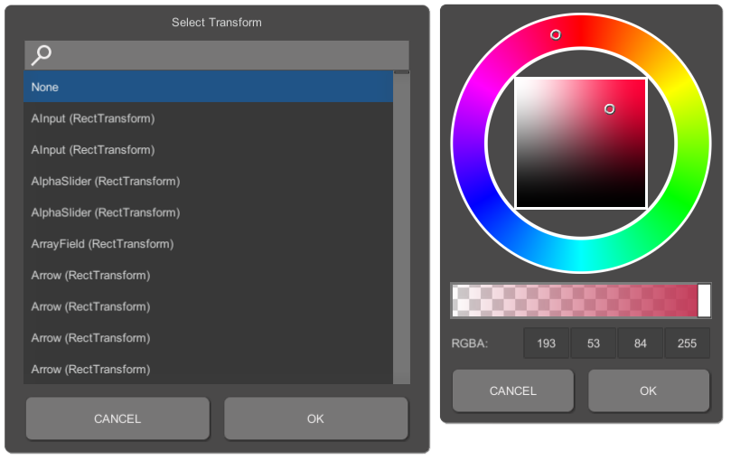
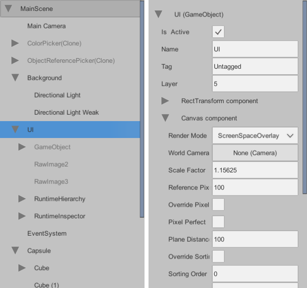
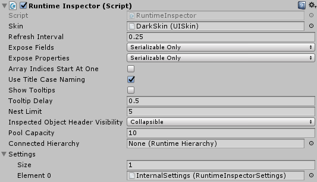
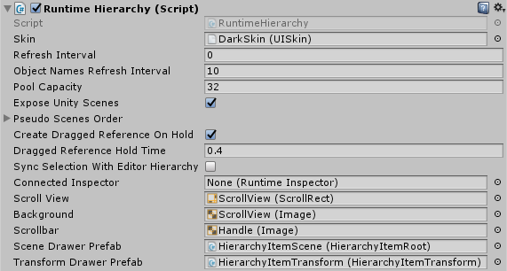

# Runtime Inspector and Hierarchy for Unity 3D

 

**Available on Asset Store:** https://www.assetstore.unity3d.com/en/#!/content/111349

**Forum Thread:** https://forum.unity.com/threads/runtime-inspector-and-hierarchy-open-source.501220/

## A. ABOUT

This is a simple yet powerful runtime **Inspector** and **Hierarchy** solution for Unity 3D that should work on pretty much any platform that Unity supports, including mobile platforms. Simply import **RuntimeInspector.unitypackage** to your project to get started!

## B. HOW TO USE
- To use the hierarchy in your scene, drag&drop the **RuntimeHierarchy** prefab to your canvas
- To use the inspector in your scene, drag&drop the **RuntimeInspector** prefab to your canvas

You can connect the inspector to the hierarchy so that whenever the selection in the hierarchy changes, inspector inspects the newly selected object. To do this, assign the inspector to the **Connected Inspector** property of the hierarchy.

You can also connect the hierarchy to the inspector so that whenever an object reference in the inspector is highlighted, the selection in hierarchy is updated. To do this, assign the hierarchy to the **Connected Hierarchy** property of the inspector.

Note that these connections are *one-directional*, meaning that assigning the inspector to the hierarchy will not automatically assign the hierarchy to the inspector or vice versa. Also note that the inspector and the hierarchy are **not** singletons and therefore, you can have several instances of them in your scene at a time with different configurations.

## C. FEATURES
- The hierarchy costs **1 SetPass call** and **~4 batches** (assuming that **Sprite Packing** is enabled in *Editor Settings*)
- The inspector costs **1 SetPass call** and **~10 batches** (assuming that **Sprite Packing** is enabled in *Editor Settings*)
- Both panels are heavily optimized in terms of GC in order not to generate any unnecessary garbage. By default, both the inspector and the hierarchy are refreshed every frame to reflect any changes to their user interface immediately. This generates some garbage especially for the inspector as, most of the time, the inspected object has variables of value types. These variables are *boxed* when accessed via reflection and this boxing creates some unavoidable garbage. However, this process can be greatly optimized by increasing the **Refresh Interval** of the inspector and/or the hierarchy
- Includes a built-in color picker and a reference picker:



- Visual appearance of the inspector and the hierarchy can be tweaked by changing their **Skin**. There are two premade skins included in the **Skins** directory: *LightSkin* and *DarkSkin* (pro-only.. meh, just kiddin'). You can create your own skins using the **Create-RuntimeInspector-UI Skin** context menu



Be aware that the changes made to a skin via the Unity Inspector might not be reflected to the UI immediately. To reflect these changes to the UI, you may have to click the *cog icon* while the skin is selected and select **Refresh UI**.

- The hierarchy can be synced with Unity Hierarchy by simply enabling **Sync Selection With Editor Hierarchy**

### C.1. INSPECTOR



RuntimeInspector works similar to the editor Inspector. It can expose commonly used Unity types out-of-the-box, as well as custom classes and structs that are marked with **System.Serializable** attribute. 1-dimensional arrays and generic Lists are also supported. 

- **Refresh Interval**: as the name suggests, this is the refresh interval of the inspector. At each refresh, values of all the exposed fields and properties are refreshed. This generates some garbage for boxed value types (unavoidable) and thus, increasing this value even slightly should help with GC a lot
- **Debug Mode**: when enabled, non-public variables that don't have a **SerializeField** attribute can be exposed
- **Expose Private Fields**: when enabled, private fields can be exposed
- **Expose Public Fields**: when enabled, public fields can be exposed
- **Expose Private Properties**: when enabled, private properties can be exposed
- **Expose Public Properties**: when enabled, public properties can be exposed
- **Array Indices Start At One**: when enabled, exposed arrays and lists start their indices at 1 instead of 0 (just a visual change)
- **Use Title Case Naming**: when enabled, variable names are displayed in title case format (e.g. *m_myVariable* becomes *My Variable*)
- **Nest Limit**: imagine exposing a linked list. This variable defines how many nodes you can expose in the inspector starting from the beginning node until the inspector stops exposing any further nodes
- **Pool Capacity**: the UI elements are pooled to avoid unnecessary *Instantiate* and *Destroy* calls. This value defines the pool capacity for each of the UI elements individually. On standalone platforms, you can increase this value for better performance
- **Settings**: an array of settings for the inspector. A new settings asset can be created using the **Create-RuntimeInspector-Settings** context menu. A setting asset stores 4 different things:
  - **Standard Drawers** and **Reference Drawers**: a drawer is a prefab used to expose a single variable in the inspector. For variables that extend **UnityEngine.Object**, a reference drawer is created and for all the other variables, a standard drawer is created. Think of it like this: when you select a GameObject in Unity Hierarchy, it is exposed in Unity Inspector using a standard drawer with all of its variables and components. When you create a script with a public GameObject variable, the variable is exposed in Unity Inspector using a reference drawer
    - While searching for a suitable drawer for a variable, the corresponding drawers list is traversed from bottom to top until a drawer that supports that variable type is found. If such a drawer is not found, that variable is not exposed
  - **Hidden Variables**: allows you to hide some variables from the inspector for a given type and all the types that extend/implement it. You can enter asterisk character (\*) to hide all the variables for that type
  - **Exposed Variables**: allows you to expose (counter) some hidden variables. A variable goes through a number of filters before it is exposed:
  1. If it is in *Exposed Variables*, it is exposed
  2. Otherwise, it must pass the *Expose Private Fields*, *Expose Public Fields*, *Expose Private Properties* and *Expose Public Properties* filters
  3. It must not be in *Hidden Variables*
  4. It must not have a *System.Obsolete*, *System.NonSerialized* or *HideInInspector* attribute
  5. It must be serializable or *Debug Mode* must be enabled
  - So, to expose only a specific set of variables for a given type, you can hide all of its variables by entering an asterisk to its *Hidden Variables* and then entering the set of exposed variables to its *Exposed Variables*

You are advised not to change the **InternalSettings** but create a separate Settings asset and add it to the **Settings** array of the inspector if you want to tweak its settings. Otherwise, when *InternalSettings* is changed on an update, your settings might be overridden.

### C.2. HIERARCHY



RuntimeHierarchy simply exposes the objects in your scenes to the user interface. In addition to exposing the currently active Unity scenes in the hierarchy, you can also expose a specific set of objects under what is called a **pseudo-scene** in the hierarchy. Pseudo-scenes can help you categorize the objects in your scene. Adding/removing objects to/from pseudo-scenes is only possible via the scripting API and helper components.

- **Refresh Interval**: the refresh interval of the hierarchy. At each refresh, the destroyed objects are removed from the hierarchy while newly created objects are added to the hierarchy. Sibling indices of the objects are also synced with the Unity Hierarchy at each refresh
- **Object Names Refresh Interval**: accessing **GameObject.name** property generates garbage. Therefore, names of objects in the hierarchy are not synced at each *Refresh Interval* but rather at each *Object Names Refresh Interval* to help avoid excessive garbage
- **Pool Capacity**: the capacity of the pool that stores the unused UI elements for future use to avoid unnecessary *Instantiate* and *Destroy* calls
- **Expose Unity Scenes**: when disabled, Unity scenes are not exposed in the hierarchy. This is useful when you want to use the hierarchy solely for pseudo-scenes
- **Pseudo Scenes Order**: the order of the pseudo-scenes from top to bottom in the hierarchy. Note that entering a pseudo-scene here does not automatically create it when the application starts. Pseudo-scenes can be created via the scripting API only
- **Create Dragged Reference On Hold**: when enabled, if you click and hold on an object in the hierarchy for a while, a **dragged reference item** will be created that can be dropped on a *reference drawer* in the inspector to assign that object to that variable (similar to Unity's drag&drop reference assignment)
- **Dragged Reference Hold Time**: this value defines the hold time in seconds before a dragged reference item is created
- **Can Reorganize Items**: when enabled, dropping a dragged reference item that holds a Transform onto an object in the hierarchy will change the dragged Transform's parent (similar to parenting in Unity's Hierarchy)
- **Double Click Threshold**: when an object in the hierarchy is double clicked, **OnItemDoubleClicked** event is raised (see *SCRIPTING API*). This value determines the maximum allowed delay between two clicks to register a double click
- **Sync Selection With Editor Hierarchy**: simply synces the selected object between the Unity Hierarchy and this RuntimeHierarchy

## D. SCRIPTING API
Values of the variables that are mentioned in **C.1** and **C.2** sections can be tweaked at runtime via their corresponding properties. Any changes to these properties will be reflected to UI immediately. Here, you will find some interesting things that you can do with the inspector and the hierarchy via scripting:

- You can change the inspected object in the inspector using the following functions:

```csharp
public void Inspect( object obj );
public void StopInspect();
```

- You can access the currently inspected object via the `InspectedObject` property of the inspector
- You can change the selected object in the hierarchy using the following functions:

```csharp
public bool Select( Transform selection ); // returns true when the selection is changed successfully
public void Deselect();
```

- You can access the currently selected object in the hierarchy via the `CurrentSelection` property
- You can call the `Refresh()` function on the inspector and/or the hierarchy to refresh them manually
- You can register to the `OnSelectionChanged` event of the hierarchy to get notified when the selection has changed
- You can register to the `OnInspectedObjectChanging` delegate of the inspector to get notified when the inspected object is about to change and, if you prefer, change the inspected object altogether. For example, if you want to inspect only objects that have a *Renderer* component attached, you can use the following function:

```csharp
private object OnlyInspectObjectsWithRenderer( object previousInspectedObject, object newInspectedObject )
{
	GameObject go = newInspectedObject as GameObject;
	if( go != null && go.GetComponent<Renderer>() != null )
		return newInspectedObject;

	// Don't inspect objects without a Renderer component
	return null;
}
```

- You can register to the `OnItemDoubleClicked` event of the hierarchy to get notified when an object in the hierarchy is double clicked
- You can add **RuntimeInspectorButton** attribute to your functions to expose them as buttons in the inspector. These buttons appear when an object of that type is inspected. This attribute takes 3 parameters:
  - **string label**: the text that will appear on the button
  - **bool isInitializer**: if set to true, and if the function returns an object that is assignable to the type that the function was defined in, the resulting value of the function will be assigned back to the inspected object. In other words, this function can be used to initialize null objects or change the variables of alive objects
  - **ButtonVisibility visibility**: determines when the button can be visible. Buttons with `ButtonVisibility.InitializedObjects` can appear only when the inspected object is not null whereas buttons with `ButtonVisibility.UninitializedObjects` can appear only when the inspected object is null. You can use `ButtonVisibility.InitializedObjects | ButtonVisibility.UninitializedObjects` to always show the button in the inspector

- Although you can't add *RuntimeInspectorButton* attribute to Unity's built-in functions, you can show buttons under built-in Unity types via **extension methods**. You must write all such extension methods in a single static class, mark the methods with *RuntimeInspectorButton* attribute and then introduce these functions to the RuntimeInspector as following: `RuntimeInspectorUtils.ExposedExtensionMethodsHolder = typeof( TheScriptThatContainsTheExtensionsMethods );`

### D.1. PSEUDO-SCENES
You can use the following functions to add object(s) to pseudo-scenes in the hierarchy:

```csharp
public void AddToPseudoScene( string scene, Transform transform );
public void AddToPseudoScene( string scene, IEnumerable<Transform> transforms );
```

These functions will create the relevant pseudo-scenes automatically if they do not exist.

You can use the following functions to remove object(s) from pseudo-scenes in the hierarchy:

```csharp
public void RemoveFromPseudoScene( string scene, Transform transform, bool deleteSceneIfEmpty );
public void RemoveFromPseudoScene( string scene, IEnumerable<Transform> transforms, bool deleteSceneIfEmpty );
```

You can use the following functions to create or delete a pseudo-scene manually:

```csharp
public void CreatePseudoScene( string scene );
public void DeletePseudoScene( string scene );
public void DeleteAllPseudoScenes();
```

#### D.1.1. PseudoSceneSourceTransform
This helper component allows you to add an object's children to a pseudo-scene in the hierarchy. When a child is added to or removed from the object, this component refreshes the pseudo-scene automatically. If **HideOnDisable** is enabled, the object's children are removed from the pseudo-scene when the object is disabled.

### D.2. DRAGGED REFERENCE ITEMS
In section **C.2**, it is mentioned that you can drag&drop objects from the hierarchy to the variables in the inspector to assign these objects to those variables. However, you are not limited with just hierarchy. There are two helper components that you can use to create dragged reference items for other objects:

- **DraggedReferenceSourceCamera**: when attached to a camera, casts a ray to your scene at each mouse click and creates a dragged reference item if you hold on an object for a while. You can register to the **ProcessRaycastHit** delegate of this component to filter the objects than can create a dragged reference item. For example, if you want only objects with tag *NPC* to be able to create a dragged reference item, you can use the following function:

```csharp
private Object CreateDraggedReferenceItemForNPCsOnly( RaycastHit hit )
{
	if( hit.collider.gameObject.CompareTag( "NPC" ) )
		return hit.collider.gameObject;

	// Non-NPC objects can't create dragged reference items
	return null;
}
```

- **DraggedReferenceSourceUI**: when assigned to a UI element, that element can create a dragged reference item for its **Reference** object after it is clicked and held for a while

You can also use your own scripts to create dragged reference items by calling the following function in the **RuntimeInspectorUtils** class:

```csharp
public static DraggedReferenceItem CreateDraggedReferenceItem( Object reference, PointerEventData draggingPointer, UISkin skin = null );
```

Note that dragged reference items are created on a separate **Screen Space - Overlay** canvas so that they can be drawn on top of everything. You may want to change this canvas's properties for UI consistency (like its *CanvasScaler*'s properties). In that case, simply use the **RuntimeInspectorUtils.DraggedReferenceItemsCanvas** property to access this canvas.

### D.3. CUSTOM PROPERTY DRAWERS
**NOTE**: this section is about giving you a brief idea on how to create your own drawers. As the amount of information presented here might be overwhelming or boring, you are also recommended to examine some of the built-in drawers to have a better idea about the architecture. For starters, you can examine **BoolField** and continue with **BoundsField** and **GameObjectField**.

You can introduce your own property drawers to the inspector to extend its functionality using a **Settings** asset mentioned in section **C.1**. Each property drawer extends from **InspectorField** base class. There is also an **ExpandableInspectorField** abstract class that allows you to create an expandable/collapsable property drawer like arrays and **ObjectReferenceField** class that allows you to create drawers that can be assigned values via the reference picker or via drag&drop.

#### D.3.1. InspectorField

To have a standardized visual appearance across all the property drawers, there are some common variables for each drawer:
- **Layout Element**: is used to set the height of the property drawer. A standard height is set by the currently active Inspector skin's **Line Height** property. This value is multiplied by the virtual **HeightMultiplier** property of the drawer. For ExpandableInspectorField's of unknown height, this variable should be left unassigned
- **Variable Name Text**: the **Text** object that displays the name of the exposed variable
- **Variable Name Mask**: to understand this one, you may have to examine a simple property drawer like BoolField. An **Image** is drawn on top of the *Variable Name Text* in order to mask its visible area in an efficient way. And this mask is assigned to this variable

Each property drawer has access to the following properties:
- **object Value**: the most recent value of the variable that this drawer is bound to. It is refreshed at each refresh interval of the inspector. Changing this property will also change the bound object
- **RuntimeInspector Inspector**: the RuntimeInspector that currently uses this drawer
- **UISkin Skin**: the skin that is assigned to this drawer
- **Type BoundVariableType**: the type of the bound object
- **int Depth**: the depth that this drawer is drawn at. As Depth increases, a padding should be applied to the contents of this drawer from left
- **string Name**: the name of the bound variable. When set, the variable name is converted to title case format, if *Use Title Case Naming* is enabled in the inspector
- **string NameRaw**: When set, the variable name is used as is without being converted to title case format
- **float HeightMultiplier**: affects the height of the drawer

There are some special functions on drawers that are invoked on certain circumstances:
- **bool SupportsType( Type type )**: returns whether or not this property drawer can expose (supports) a certain type in the inspector
- **void Initialize()**: should be used instead of *Awake*/*Start* to initialize the drawer
- **void OnBound()**: called when the drawer is bound to a variable via reflection
- **void OnUnbound()**: called when the drawer is unbound from the variable that it was bound to
- **void OnInspectorChanged()**: called when the *Inspector* property of the drawer is changed
- **void OnSkinChanged()**: called when the *Skin* property of the drawer is changed. Your custom drawers must adjust their UI elements' visual appearance here to comply with the assigned skin's standards
- **void OnDepthChanged()**: called when the *Depth* property of the drawer is changed. Here, your custom drawers must add a padding to their content from left to comply with the nesting standard. This function is also called when the *Skin* changes
- **void Refresh()**: called when the value of the bound object is refreshed. Drawers must refresh the values of their UI elements here

#### D.3.2. ExpandableInspectorField

Custom drawers that extend **ExpandableInspectorField** have access to the following properties:
- **bool IsExpanded**: returns whether the drawer is expanded or collapsed. When set to *true*, the drawer is expanded and its content is drawn under it
- **int Length**: the number of elements that this drawer aims to draw. If its value does not match the number of child drawers that this drawer has, the contents of the drawer are regenerated

*ExpandableInspectorField* has the following special functions:
- **void GenerateElements()**: the sub-drawers of this drawer must be generated here 
- **void ClearElements()**: the sub-drawers of this drawer must be cleared here

Sub-drawers of an ExpandableInspectorField should be stored in the `protected List<InspectorField> elements` variable as ExpandableInspectorField uses this list to compare the number of sub-drawers with the *Length* property. Also, when *Refresh()* is called, sub-drawers in this list are also refreshed automatically and when *ClearElements()* is called, sub-drawers in this list are cleared automatically.

You can create sub-drawers using the `RuntimeInspector.CreateDrawerForType( Type type, Transform drawerParent, int depth, bool drawObjectsAsFields = true )` function. If no property drawer is found that can expose this type, the function returns *null*. Here, for ExpandableInspectorField's, the **drawerParent** parameter should be set as the **drawArea** variable of the ExpandableInspectorField. If the **drawObjectsAsFields** parameter is set to true and if the type extends **UnityEngine.Object**, *Reference Drawers* are searched for a drawer that supports this type. Otherwise *Standard Drawers* are searched.

After creating sub-drawers, *ExpandableInspectorField*'s must bind their sub-drawers to their corresponding variables manually. This is done via the following **BindTo** functions of the *InspectorField* class:
- `BindTo( InspectorField parent, MemberInfo member, string variableName = null )`: binds the object to a **MemberInfo** (it can be received via reflection). Here, **parent** parameter should be set to this *ExpandableInspectorField*. If **variableName** is set to null, its value is fetched directly from the MemberInfo parameter
- `BindTo( Type variableType, string variableName, Getter getter, Setter setter )`: this one allows you to define your own getter and setter functions for this sub-drawer. For example, *ArrayField* uses this function because there is no direct MemberInfo to access an element of an array. With this method, you can use custom functions instead of MemberInfo's to get/set the values of the bound objects (ArrayField uses *Array.GetValue* for its elements' getter function and *Array.SetValue* for its elements' setter function)

There are actually some helper functions in ExpandableInspectorField to easily create sub-drawers without having to call *CreateDrawerForType* or *BindTo* manually (I've mentioned them before so that you get an idea of how to manually create a drawer and bind it to a variable):
- `InspectorField CreateDrawerForComponent( Component component, string variableName = null )`: creates a *Standard Drawer* for a component
- `InspectorField CreateDrawerForVariable( MemberInfo variable, string variableName = null )`: creates a drawer for the variable that the *MemberInfo* stores
- `InspectorField CreateDrawer( Type variableType, string variableName, Getter getter, Setter setter, bool drawObjectsAsFields = true )`: similar to the *BindTo* function with the *Getter* and *Setter* parameters, allows you to use custom functions to get and set the value of the object that the sub-drawer is bound to

If you don't want the name of the variable to be title case formatted, you can enter an empty string as the **variableName** parameter and then set the *NameRaw* property of the returned *InspectorField* object.

#### D.3.3. ObjectReferenceField

Property drawers that extend **ObjectReferenceField** class have access to the `void OnReferenceChanged( Object reference )` function that is called when the reference assigned to that drawer is changed.

#### D.3.4. Helper Classes

**PointerEventListener**: this is a simple helper component that invokes **PointerDown** event pressed, **PointerUp** event when released and **PointerClick** event when clicked

**BoundInputField**: most of the built-in drawers use this component for their input fields. This helper component allows you to validate the input of the input field when the input has changed and get notified when the input is submitted. It has the following properties and functions:
- **string DefaultEmptyValue**: the default value that the input field will have when its input is empty. For DecimalField and IntegerField drawers, this value is "0"
- **string Text**: a property to refresh the current value of the input field. If the input field is currently focused and being edited, then this property will not change its text immediately but store the value in a variable so that it can be used when the input field is no longer focused. Also, setting this property will not invoke the *OnValueChanged* event
- **UISkin Skin**: the skin that this input field uses. When set, input field will adjust its UI accordingly
- **OnValueChangedDelegate OnValueChanged**: called while the value of input field is being edited (called at each change to the input). The **OnValueChangedDelegate** has the following signature: `bool OnValueChangedDelegate( BoundInputField source, string input )`. A function that is registered to this event should parse the **input** and return *true* if the input is valid, *false* otherwise
- **OnValueChangedDelegate OnValueSubmitted**: called when user finishes editing the value of input field. Similar to *OnValueChanged*, a function that is registered to this event should parse the **input** and return *true* only if the input is valid
